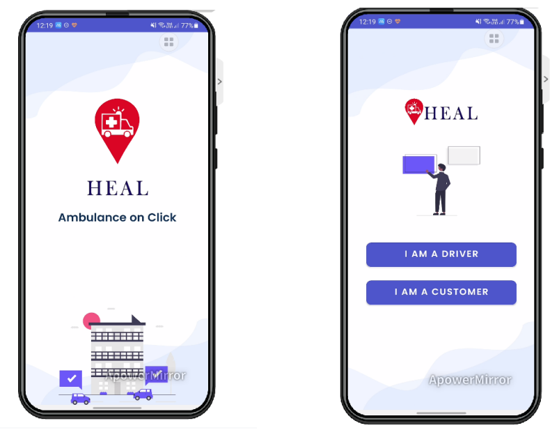
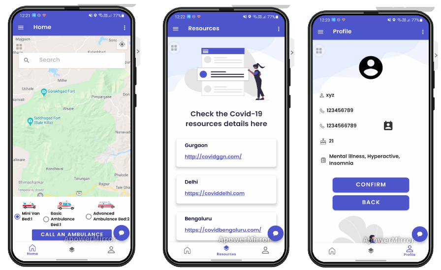
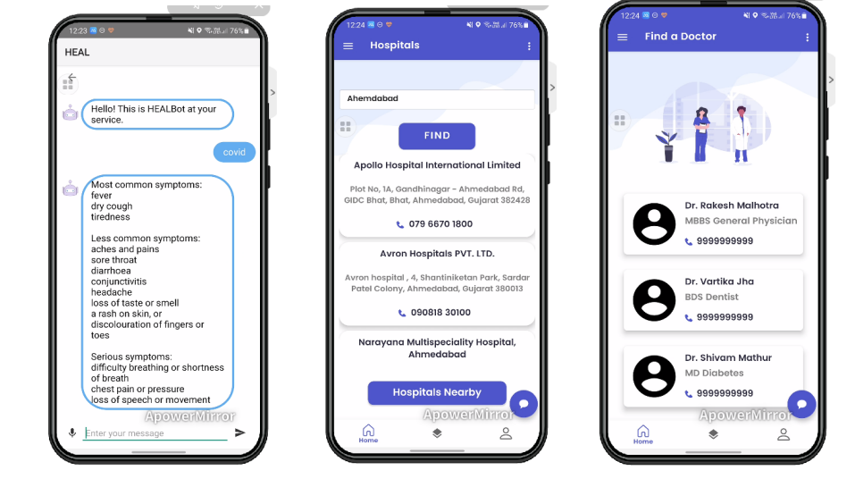
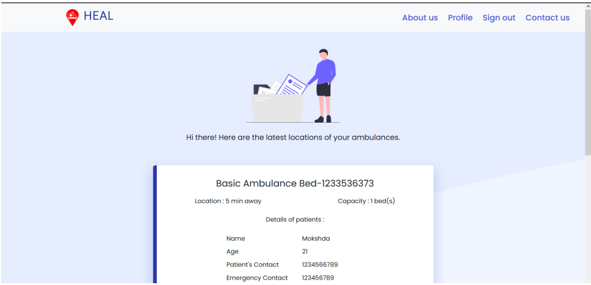
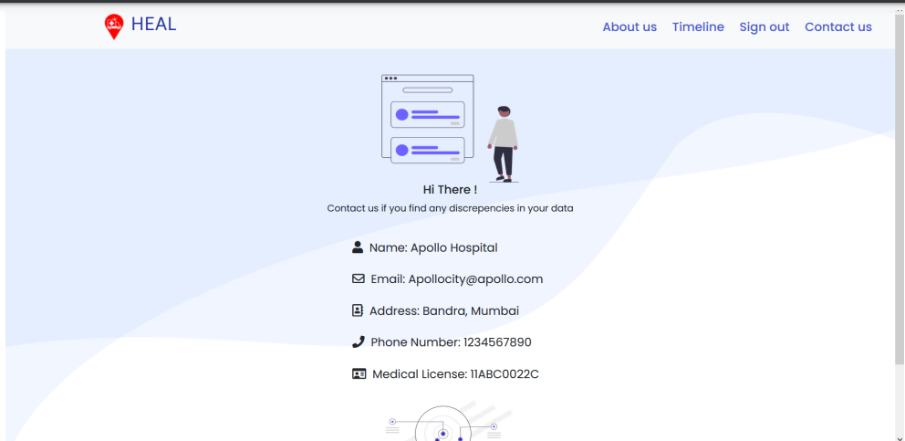

# HEAL-APP
Our application revolves around the difficult accessibility to ambulance services as well as First-Aid guides and unawareness among citizens as to what steps to take. It is well known that easy &amp; timely availability of ambulances can save a lot of lives, especially in case of emergencies. The state of emergency medical transport i.e. ambulances is a vast issue. Oftentimes, people are unaware of how beneficial first aid proves to be, and our app ensures that this information reaches our users as well through an interactive Chatbot that is made voice enabled in case of panic and a pictorial step to step guide of some very frequent emergencies.

## Screenshots

### Home Page

### Customer UI

### Chatbot and other features

### Website for Hospitals

